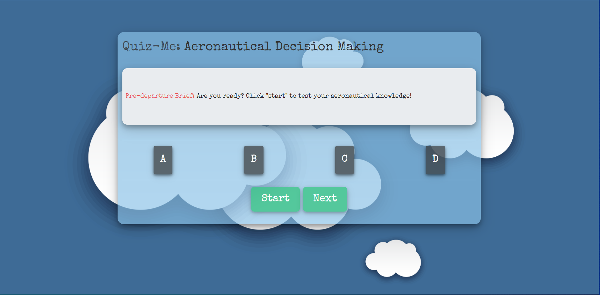

# Quiz-Me 
Making an online quiz using JavaScript and Bootstrap for some style!

Page Link: https://sclitty.github.io/Quiz-Me/index.html

The quiz is a potential start to a Flight-Training application for student pilots or current pilots who want to get back to the basics.
The focus material is on Aeronautical-Decision-Making (ADM). Pre-flight risk assessment and mitigation practices. 

The quiz is a timed test of your knowledge on Aeronautical Decision Making. Scored based on time remaining and wrong answers take a time penalty. You must select the correct answer to proceed to the next question. It's more of a teaching tool that provides immediate feedback. In the future I would like to continue working on making an app that holds multiple learning tools and provides resources based on incorrect answers.

